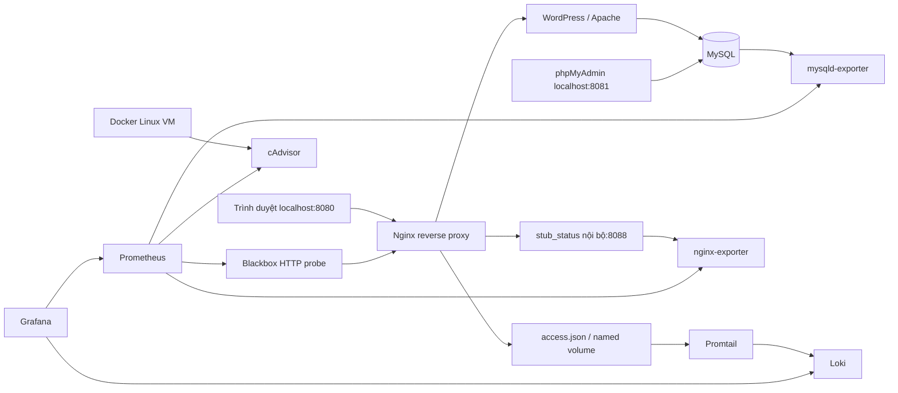

# Portfolio Nguyễn Văn Mạnh — DTC245200147

Đề tài: **Website Portfolio / Giới thiệu cá nhân**. Môi trường: Windows, PowerShell, VS Code, Docker Desktop chạy Linux containers.

Sinh viên **Nguyễn Văn Mạnh**, mã **DTC245200147**, **Khoa Công Nghệ Thông Tin**, lớp **CNTTK23B**. Học phần **Triển khai và Quản trị Hệ thống Phần mềm**, giảng viên **Nguyễn Anh Chuyên**. GitHub: [NguyenVanManh147](https://github.com/NguyenVanManh147). Hạn nộp chưa được cung cấp; cần đối chiếu lịch chính thức trước khi nộp.

Dự án dùng **WordPress**, giữ database, uploads, theme Twenty Twenty-Five và các trang cá nhân trên máy hiện tại. Cấu hình Docker Compose, Nginx, monitoring và logging nằm trong repository; nội dung được xuất vào `wordpress/portfolio-export.xml`, 14 ảnh nằm trong `wordpress/uploads/`. Máy mới có thể dựng lại nội dung bằng script bootstrap bên dưới.

Kiểm thử hệ thống ngày **08/10/2026** đạt **37/40**: website, quản trị, database, metrics và LogQL hoạt động. Ba mục chưa đạt là độ dài mật khẩu MySQL user, MySQL root và Grafana: **11 ký tự**, dưới mức **20** của bộ kiểm tra. Giữ nguyên mật khẩu theo lựa chọn của sinh viên và ghi rõ giới hạn này; kết quả không được trình bày thành 40/40.

Đọc [kết quả kiểm thử](docs/verification.md), [danh mục minh chứng](evidence/README.md), [báo cáo HTML](docs/report.html) và [báo cáo PDF](docs/BaoCao_DTC245200147_NguyenVanManh.pdf). [Audit ban đầu](docs/audit.md) và [quy trình bảo trì root](docs/root-maintenance.md) ghi lại quá trình khôi phục, cần phân biệt với trạng thái hiện tại.

## Kiến trúc



Mạng `application`, `database`, `monitoring` là internal. WordPress tham gia `outbound` để cài/cập nhật từ WordPress.org. phpMyAdmin/Grafana/Prometheus có mạng `administration` cho các cổng localhost. MySQL, exporters, Loki và Promtail không publish cổng ra Windows. Nginx là đường truy cập ứng dụng.

## Chuẩn bị và khởi động

1. Cài Docker Desktop, bật WSL2/Linux containers, khởi động Docker Desktop. Có thể cần quyền truy cập Docker daemon.
2. Mở đúng folder trong VS Code. Cài Python 3 để chạy script khởi tạo tự động và kiểm thử; ứng dụng chạy bằng Docker Compose.
3. Kiểm tra Docker và dung lượng trước khi chạy.

```powershell
Set-Location 'D:\5_Thi_TrienKhaiThietKe\DTC245200147_NguyenVanManh'
docker version
docker compose version
Get-CimInstance Win32_LogicalDisk | Select-Object DeviceID, Size, FreeSpace
```

**Trên máy hiện tại, giữ nguyên `.env` và các mật khẩu đã chọn.** Đăng nhập MySQL user/root, WordPress và Grafana đã được xác minh. `.env` chứa thông tin riêng tư và bị loại khỏi Git. Không chạy `Copy-Item .env.example .env -Force` trên database hiện có; sửa biến môi trường không tự đổi mật khẩu đã lưu trong volumes.

Chỉ khi clone vào **máy mới chưa có `.env`**, tạo mật khẩu ngẫu nhiên bằng script không ghi đè file:

```powershell
powershell -ExecutionPolicy Bypass -File .\scripts\Initialize-Env.ps1
```

Script sinh bốn mật khẩu khác nhau cho MySQL user/root, WordPress admin và Grafana, mỗi mật khẩu 24 random bytes biểu diễn bằng 48 ký tự hex. `.env.example` chỉ có placeholders. Các image chính được pin bằng digest đã quan sát; `monitoring/images.lock.json` ghi tham chiếu công khai. Không thay sang phiên bản tùy ý khi đang dùng volumes cũ.

```powershell
docker compose config --quiet
docker compose up -d --wait --wait-timeout 180
docker compose ps -a
```

`config --quiet` kiểm tra YAML/interpolation mà không in mật khẩu. `loki-init` kết thúc mã 0 là bình thường: nó chuẩn bị quyền thư mục Loki/Promtail và không xóa dữ liệu. Profile `legacy-alloy` không chạy mặc định; collector theo đề là **Promtail**. Container Alloy cũ đã được dừng, volume vẫn còn.

## Địa chỉ và quản trị nội dung

| Dịch vụ | URL mặc định | Đăng nhập |
|---|---|---|
| Portfolio | http://localhost:8080/ | Công khai trên máy local |
| WordPress admin | http://localhost:8080/wp-admin/ | Tài khoản WordPress hiện có; không đổi mật khẩu tài khoản này trong quá trình sửa |
| phpMyAdmin | http://localhost:8081/ | MYSQL_USER và MYSQL_PASSWORD trong `.env`; chọn portfolio_db |
| Prometheus targets | http://localhost:9090/targets | Không auth; cổng chỉ bind localhost |
| Grafana | http://localhost:3000/ | GRAFANA_ADMIN_USER và GRAFANA_ADMIN_PASSWORD trong `.env` |

Trong WordPress: **Trang → Tất cả các trang** → chọn trang → sửa nội dung → **Lưu/Cập nhật**; mở lại trang ngoài website để kiểm tra nội dung vừa lưu. **Giao diện → Trình chỉnh sửa** chỉnh navigation/theme. MU plugin tắt trình chỉnh sửa file PHP trong admin; trình chỉnh sửa nội dung/theme blocks vẫn dùng được. Website là portfolio giới thiệu; trang liên hệ là nội dung cá nhân hiện có, không khai báo đã tích hợp gửi email.

Để kiểm tra database trong phpMyAdmin, chọn database rồi xem các bảng `wp_posts`, `wp_options`, `wp_users`. Chỉ mở những dữ liệu cần thiết cho báo cáo; không chụp hash mật khẩu.

### Dựng nội dung trên một máy mới

Docker volumes không nằm trong Git. Sau khi cài Docker Desktop, Git và Python 3, clone repository vào máy mới rồi dựng lại nội dung:

```powershell
git clone https://github.com/NguyenVanManh147/DTC245200147_NguyenVanManh.git
Set-Location .\DTC245200147_NguyenVanManh
powershell -NoProfile -ExecutionPolicy Bypass -File .\scripts\Bootstrap-WordPress.ps1
```

Lệnh này tạo `.env` nếu chưa có, khởi động MySQL/WordPress, cài WordPress và thử tải gói tiếng Việt, nhập nội dung từ `wordpress/portfolio-export.xml` cùng 14 ảnh trong `wordpress/uploads/`, chọn Twenty Twenty-Five, đặt Trang chủ tĩnh và gắn navigation vào header. Sau đó khởi động các dịch vụ còn lại. Không cần cài plugin importer hay WP-CLI. Python dùng thư viện chuẩn; mã PHP gọi API WordPress trong image đã pin.

Mở `http://localhost:8080/`; quản trị ở `/wp-admin/`. **Trên site mới**, tài khoản và mật khẩu nằm trong `WORDPRESS_ADMIN_USER` và `WORDPRESS_ADMIN_PASSWORD` của `.env` riêng tư. Có thể sửa các giá trị này **trước lần cài đầu tiên**. Trên site đã cài, thay `.env` không đổi mật khẩu WordPress: dùng chức năng đổi mật khẩu trong admin. Nếu `.env` cũ chưa có thông tin WordPress, script chỉ bổ sung credential khi thực sự cài database trống.

Script kiểm tra trước khi nhập: site đã cài thì bỏ qua và giữ dữ liệu/tài khoản; database có bảng nhưng chưa cài WordPress hoặc thư mục uploads có file thì dừng. Nếu lần khởi tạo trước bị gián đoạn, script báo lỗi để kiểm tra và phục hồi, không tự nhập lại hoặc xóa volume. URL nội dung/ảnh được đổi theo `WEB_PORT` trên site mới; theme/image phải có trong image WordPress đã pin. Khi tải được gói ngôn ngữ, giao diện dùng tiếng Việt. Nếu WordPress.org không truy cập được hoặc chưa cung cấp gói tương ứng, script thông báo giao diện quản trị dùng tiếng Anh; nội dung portfolio vẫn tiếng Việt và có thể chọn lại ngôn ngữ trong Settings sau này.

Kiểm thử tích hợp riêng (cần Docker, Python; tạo rồi xóa **chỉ project thử nghiệm** với tiền tố `portfolio-bootstrap-check-`):

```powershell
python -u .\scripts\test-bootstrap.py
```

Kết quả thật ở [evidence/bootstrap-validation.json](evidence/bootstrap-validation.json): kiểm tra database trống, bảo vệ dữ liệu, nội dung/ảnh/menu, đăng nhập admin và chạy lại. Đây là kiểm thử volumes mới trên Docker Desktop hiện tại; chưa thay thế kiểm thử một máy vật lý khác. WXR không phải bản sao lưu database/theme hoàn chỉnh; SQL riêng tư trong `backups/` là bản sao lưu bổ sung của máy hiện tại, không commit lên Git.

## Kiểm tra dịch vụ

```powershell
docker compose config --quiet
docker compose exec -T nginx nginx -t
docker compose exec -T prometheus promtool check config /etc/prometheus/prometheus.yml
docker compose exec -T loki /usr/bin/loki -config.file=/etc/loki/loki.yml -verify-config=true
docker compose exec -T promtail /usr/bin/promtail -config.file=/etc/promtail/promtail.yml -check-syntax
curl.exe --max-time 15 -I http://localhost:8080/
curl.exe --max-time 15 -I http://localhost:8080/wp-login.php
curl.exe --max-time 15 -I http://localhost:8081/
```

Kiểm thử mở rộng với Python, có cả APIs Grafana và LogQL thật:

```powershell
powershell -ExecutionPolicy Bypass -File .\scripts\Test-System.ps1
# Hoặc:
python -u .\scripts\verify.py
```

Kết quả được ghi vào `evidence/verification.json` và tổng hợp trong `docs/verification.md`. Script trả mã 1 khi có mục chưa đạt. Với mật khẩu hiện tại, ba kiểm tra độ dài vẫn FAIL dù đăng nhập và chức năng dịch vụ PASS. Script sinh request 403/404 thật để kiểm chứng filter log. Một số phép tính `rate` cần ít nhất hai lần scrape; chờ khoảng 30–60 giây sau khi khởi động rồi chạy.

Kiểm thử riêng thao tác quản trị nội dung:

```powershell
python -u .\scripts\test-wordpress-edit.py
```

Script đăng nhập bằng mật khẩu, tạo một trang nháp có định danh riêng, sửa nội dung và xuất bản qua WordPress REST API trong phiên admin, rồi truy cập ẩn danh để kiểm tra nội dung mới. Sau đó chỉ xóa trang thử và revisions của trang đó, đối chiếu chữ ký dữ liệu trang, metadata và tùy chọn cá nhân trước/sau. Kết quả công khai ghi vào `evidence/wordpress-edit.json`; mật khẩu, nonce và cookies không được lưu trong minh chứng. Tham số `--capture` chụp giao diện admin và trang công khai bằng Edge/Playwright đã cài trong môi trường minh chứng; chạy kiểm thử thông thường không cần Playwright.

Lần kiểm thử lúc **15:21 ngày 08/10/2026** đạt **13/13**. Trang đã sửa/xuất bản hiển thị HTTP 200 cho khách ẩn danh; hai ảnh thật là [trang quản trị](evidence/24-wordpress-edit-admin.png) và [trang công khai](evidence/25-wordpress-edit-public.png). Sau khi dọn trang thử, chữ ký của các posts/pages, metadata và tùy chọn cá nhân khớp bản trước kiểm thử. Xem [kết quả chi tiết](evidence/wordpress-edit.json).

## Prometheus và Grafana

Prometheus có 8 jobs: `prometheus`, `cadvisor`, `nginx`, `mysql`, `portfolio_http`, `blackbox`, `loki`, `promtail`. Mở targets kiểm tra từng job UP. **UP chỉ chứng minh scrape endpoint hoạt động**: kiểm tra thêm `nginx_up=1`, `mysql_up=1` và `probe_success=1`.

Blackbox đo HTTP khả dụng và độ trễ của website. Nginx exporter đọc `stub_status`, đo tổng requests, connections, reading/writing/waiting. `probe_success` không thay cho metrics web server; Nginx OSS stub_status cũng không cung cấp phân bố 4xx/5xx hoặc latency từng request: dùng access log/Loki cho phần này.

MySQL exporter chỉ bật **global_status/global_variables**, chạy bằng tài khoản ứng dụng giới hạn trong schema; không cần root hay `SELECT ON *.*`. Không khai báo hỗ trợ monitoring replication/Innodb collectors cần global privileges. Nếu sau này cần collector nâng cao, tạo tài khoản exporter riêng bằng credential root thực đã được xác minh rồi cấp đúng quyền theo [tài liệu mysqld-exporter](https://github.com/prometheus/mysqld_exporter); không tự tăng quyền user WordPress.

Grafana tự provision:

- Datasource **Portfolio Prometheus**, UID `portfolio-prometheus`, URL nội bộ `http://prometheus:9090`.
- Datasource **Portfolio Loki**, UID `portfolio-loki`, URL nội bộ `http://loki:3100`.
- Folder **Portfolio**, dashboard **Portfolio • Container / Nginx / MySQL**: CPU/RAM theo service, Nginx requests/connections, MySQL queries/threads và panels probe riêng.
- Dashboard **Portfolio • Nginx access logs**: log truy cập, HTTP 4xx/5xx và số requests/1 phút.

Dashboard cũ không bị xóa; provisioning dùng `disableDeletion: true`. File JSON trong Git là nguồn chỉnh sửa của hai dashboards mới.

PromQL sử dụng thực tế:

```promql
sum by (container_label_com_docker_compose_service) (rate(container_cpu_usage_seconds_total{job="cadvisor",container_label_com_docker_compose_project="portfolio-manh"}[2m])) * 100
sum by (container_label_com_docker_compose_service) (container_memory_working_set_bytes{job="cadvisor",container_label_com_docker_compose_project="portfolio-manh"})
rate(nginx_http_requests_total{job="nginx"}[2m])
nginx_connections_active{job="nginx"}
rate(mysql_global_status_queries{job="mysql"}[2m])
mysql_global_status_threads_connected{job="mysql"}
probe_success{job="portfolio_http"}
```

cAdvisor được chọn **0.56.2** để có Docker client mới và bản sửa GraphDriver nil. Image cũ 0.49.1 có thể không tương thích API tối thiểu của Engine 29; đối chiếu [release notes chính thức](https://github.com/google/cadvisor/releases/tag/v0.56.2). Metrics trong Prometheus lọc theo project `portfolio-manh`, tránh đưa container của bài khác vào dashboard.

## Loki, Promtail và ba truy vấn LogQL

Nginx ghi `/var/log/portfolio/access.json` vào named volume; Promtail mount volume đó **read-only**, đọc dữ liệu thật và lưu offsets vào `promtail_positions`. Loki dùng filesystem/TSDB schema v13 từ 2024-01-01, giữ tương thích schema đang chạy; không bật xóa retention dữ liệu cũ.

Access log chứa `time`, `remote_addr`, `method`, `uri`, `status` dạng số, `bytes_sent`, `request_time`, `upstream_response_time`. Dùng `$uri` không ghi query string/cookies/Authorization vào access log. Promtail gắn labels `project="portfolio-manh"`, `job="nginx-access"`, `service="nginx"`, cùng filename tự động. Status được parse khi truy vấn, không dùng URI/IP/status làm index labels.

Trong Grafana → **Explore** → datasource **Portfolio Loki** → khoảng thời gian **Last 15 minutes**:

1. Xem log truy cập:

```logql
{project="portfolio-manh",job="nginx-access"} | json
```

2. Lọc HTTP 4xx/5xx (400 ≤ status < 600), bỏ parse errors:

```logql
{project="portfolio-manh",job="nginx-access"} | json | __error__="" | status >= 400 | status < 600
```

3. Thống kê số requests trong cửa sổ 1 phút theo thời gian; chọn kiểu hiển thị Time series:

```logql
sum(count_over_time({project="portfolio-manh",job="nginx-access"}[1m]))
```

Tùy chọn tính requests/giây:

```logql
sum(rate({project="portfolio-manh",job="nginx-access"}[1m]))
```

Tạo traffic thật để kiểm tra truy vấn:

```powershell
1..5 | ForEach-Object { curl.exe --max-time 15 -s -o NUL http://localhost:8080/ }
curl.exe --max-time 15 -I http://localhost:8080/xmlrpc.php
curl.exe --max-time 15 -I http://localhost:8080/.env
docker compose exec -T nginx tail -n 5 /var/log/portfolio/access.json
docker compose logs --tail 30 promtail
```

`/xmlrpc.php` trả **403**, `/.env` trả **404**; sau khi Promtail gửi batch, truy vấn 2 phải thấy các dòng đó. Filter hỗ trợ cả 5xx; kiểm thử không cố làm hỏng upstream để tạo 5xx. Nếu chưa thấy log, kiểm tra time range, labels, file và Promtail → Loki; không tạo log bằng tay để chụp minh chứng.

Theo [tài liệu chính thức Grafana](https://grafana.com/docs/loki/latest/send-data/promtail/), Promtail EOL từ **02/03/2026**. Bài này giữ **Promtail 3.5.0** đúng yêu cầu và đã kiểm tra chạy với Loki 3.6.0. Alloy cũ được lưu dưới profile `legacy-alloy`; chỉ chuyển collector khi được giảng viên/người dùng chấp nhận, không tự thay Promtail trong bài.

## Hardening và cách xác minh

| Biện pháp | Áp dụng | Xác minh / giới hạn |
|---|---|---|
| Network isolation | application/database/monitoring internal; DB chỉ nối database | Network inspect Internal=true; WordPress và mysql-exporter là cầu nối có chủ đích |
| Giảm public ports | Tất cả 8080/8081/3000/9090 bind 127.0.0.1; không publish 3306/3100/exporters/stub_status | `docker compose ps`; DB/Loki vẫn có cổng nội bộ, không phải host mapping |
| Security headers | nosniff, SAMEORIGIN, Referrer-Policy, Permissions-Policy, CSP frame/object/base | `curl.exe -I`; áp dụng cả 4xx; chưa cấu hình HTTPS. Cần đối chiếu đề gốc về yêu cầu HTTPS hoặc security headers |
| Quyền DB theo ứng dụng | User WordPress chỉ có quyền trên portfolio_db, không có global privileges | phpMyAdmin `SHOW GRANTS FOR CURRENT_USER();`; quyền schema cho WordPress tạo/nâng cấp bảng |
| Mật khẩu/variables | Mật khẩu được đặt theo yêu cầu người dùng, cấu hình `.env` bị ignore | WordPress/Grafana/MySQL được kiểm tra đăng nhập riêng; mật khẩu hiện dài 11 ký tự, chưa đạt chính sách tối thiểu 20 ký tự |
| Non-root | Grafana 472, Loki/Promtail 10001, exporters/Blackbox/Prometheus 65534 | Inspect Config.User; không ép MySQL/Apache/Nginx entrypoint chạy non-root |
| Hạn chế quyền | no-new-privileges; drop ALL trên dịch vụ hỗ trợ; read-only rootfs exporters/Blackbox/Promtail; config mounts ro | Inspect SecurityOpt/CapDrop và trạng thái service; không ép DB/WordPress read-only |
| WordPress | Tắt PHP file editor, XML-RPC; chặn hidden files/wp-config; ẩn PHP/server version | Kiểm tra HTTP 403/404 và plugin source |

cAdvisor là ngoại lệ **root + privileged** để đọc cgroups/runtime của Linux VM. Docker socket và host mounts cho collector không tạo ranh giới chống truy cập Docker API; mount `:ro` không biến API thành chỉ đọc. Dịch vụ này không publish host port và chỉ phục vụ mạng monitoring. `loki-init` chạy root một lần với CHOWN/DAC_OVERRIDE để chuẩn bị quyền thư mục, rồi exit. Các ngoại lệ đã được ghi rõ thay vì áp cấu hình làm hỏng dịch vụ.

```powershell
docker network inspect portfolio-manh_application portfolio-manh_database portfolio-manh_monitoring --format '{{.Name}} internal={{.Internal}}'
docker compose ps
$runningIds = docker compose ps -q
$containerDetails = docker inspect $runningIds | ConvertFrom-Json
$containerDetails | ForEach-Object {
    [PSCustomObject]@{
        Service = $_.Config.Labels.'com.docker.compose.service'
        User = $_.Config.User
        Privileged = $_.HostConfig.Privileged
        SecurityOptions = ($_.HostConfig.SecurityOpt -join ', ')
        CapDrop = ($_.HostConfig.CapDrop -join ', ')
    }
}
git check-ignore .env backups/before-changes.sql
```

**Root MySQL hiện xác thực thành công.** Lỗi Access denied ban đầu đã được xử lý và ghi trong [quy trình root](docs/root-maintenance.md), `evidence/root-maintenance.json` và `evidence/local-root-auth.json`. Giữ mật khẩu hiện tại theo yêu cầu sinh viên; giới hạn độ dài được ghi trong báo cáo. Metrics MySQL sử dụng user ứng dụng có quyền trong schema, không phụ thuộc root.

```powershell
# Nhập bằng hộp thoại local, không có password trong câu lệnh/lịch sử:
python .\scripts\capture-local-credentials.py
# Kiểm tra xác thực root; không đổi mật khẩu:
python .\scripts\check-local-root.py
# Kiểm thử phiên admin thật; nhận password kín qua terminal hoặc file local:
python .\scripts\check-wordpress-admin.py
```

Snapshot WordPress đã thử phục hồi vào MySQL cùng image trên tmpfs/network none: đủ 12 bảng, chữ ký dữ liệu khớp, CHECK TABLE OK. `evidence/backup-validation.json` là manifest công khai; SQL ở `backups/` bị ignore. Container thử không gắn/ghi vào volume gốc. Khi đổi root, script tạo full dump với root xác thực và kiểm tra system accounts/application trên container thử trước khi sửa tài khoản.

## Git và GitHub

Source và báo cáo đã được push lên repository công khai [NguyenVanManh147/DTC245200147_NguyenVanManh](https://github.com/NguyenVanManh147/DTC245200147_NguyenVanManh), nhánh **main**. [Snapshot bàn giao](evidence/git-delivery.json) lúc **15:31 ngày 08/10/2026** xác nhận **4 commits thực**, local và remote cùng revision `7d27e84`; những commit cập nhật hồ sơ sau snapshot được xem trong lịch sử GitHub. [Ảnh repository](evidence/17b-github-repository.png) được chụp từ trang GitHub công khai. Không có phiếu đề gốc trong workspace nên chưa kết luận username GitHub phải trùng mã sinh viên; repository mang mã sinh viên để nhận diện bài.

Lịch sử có **ít nhất 3 commits thực**, chia theo ứng dụng WordPress/Nginx, cấu hình monitoring/logging, kiểm thử tái lập/quản trị và hồ sơ báo cáo/minh chứng. Không đổi ngày commit hay tạo commits rỗng. Kiểm tra lịch sử và remote bằng:

```powershell
git log --oneline --graph --decorate
git remote -v
git status --short
python .\scripts\check-source.py
```

`.env`, `secrets/`, SQL dump, credential backup và cookies không đưa lên GitHub. `scripts/check-source.py` kiểm tra các file dự kiến đưa vào Git với credential hiện tại và trước đây, không in giá trị bí mật. Repository gồm source, cấu hình mẫu, bản xuất nội dung WordPress, uploads, script tái lập, minh chứng đã lọc và báo cáo; Docker volumes và SQL backup riêng tư được lưu trên máy hiện tại.

## Minh chứng và báo cáo

`evidence/README.md` liệt kê ảnh website, quản trị, sửa/lưu nội dung, database, Compose, headers, targets, metrics, LogQL, hardening và Git. Các file JSON chứa kết quả API/lệnh thật, không chứa credentials; các file `*.capture.json` lưu nguồn, thời gian và SHA-256 của ảnh.

Báo cáo tại `docs/report.html` và `docs/BaoCao_DTC245200147_NguyenVanManh.pdf`, gồm bìa, mục tiêu, kiến trúc, triển khai, quản trị nội dung, monitoring, logging, hardening, kiểm thử và kết luận. Nếu sửa HTML, mở bằng trình duyệt → Print → A4 → Save as PDF, tắt browser header/footer. Kiểm tra `evidence/report-validation.json` để xác nhận số trang, ảnh thiếu và trang trắng của bản PDF cuối.

Trước khi nộp:

1. Kiểm tra thông tin bìa: **Công Nghệ Thông Tin / CNTTK23B**, học phần **Triển khai và Quản trị Hệ thống Phần mềm**, giảng viên **Nguyễn Anh Chuyên**; đối chiếu hạn nộp theo lịch chính thức.
2. Đọc phần nhận xét cá nhân trong kết luận, sửa lại theo trải nghiệm học tập thực tế của sinh viên.
3. Đối chiếu phiếu đề gốc về tên tài khoản/repository, số commits, yêu cầu HTTPS/security headers và quy cách báo cáo.
4. Mở link repository, kiểm tra source và lịch sử commits; mở PDF để kiểm tra bìa, hình/caption và kết quả **37/40**, cùng giới hạn ba mật khẩu 11 ký tự.
5. Khi trình bày, khởi động Docker Desktop rồi `docker compose up -d --wait --wait-timeout 180`; mở website, WordPress admin, phpMyAdmin, Prometheus và Grafana theo các URL bên trên. Có thể chạy `Test-System.ps1` và `test-wordpress-edit.py` để tái kiểm tra.

## Xử lý lỗi phổ biến

| Triệu chứng | Kiểm tra và cách xử lý |
|---|---|
| Docker permission denied / daemon unreachable | Mở Docker Desktop, kiểm tra `docker version`, Linux containers và quyền truy cập; không reset Docker |
| Read-only file system | Kiểm tra `docker info`, dung lượng C/D và `docker system df`; kiểm tra logs và Docker Desktop disk image, rồi khởi động lại Docker Desktop nếu cần; giữ volumes, không prune dữ liệu |
| Cổng 8080/8081/3000/9090 bận | `Get-NetTCPConnection -State Listen`; đổi cổng trong `.env`; đổi WordPress site URL và Host trong blackbox.yml tương ứng; không dừng/xóa stack khác |
| Nginx 502 sau recreate WordPress | Chờ WordPress healthy; `docker compose restart nginx nginx-exporter` để cập nhật DNS upstream; đọc logs Nginx/WordPress |
| MySQL Access denied | Đối chiếu credential thực với volume cũ; `.env` không đổi mật khẩu trong database. Root và user ứng dụng hiện đã xác minh; giữ mật khẩu đang sử dụng |
| phpMyAdmin login lỗi | Dùng MYSQL_USER/MYSQL_PASSWORD trong .env; xóa cookie phiên phpMyAdmin hoặc mở cửa sổ riêng tư; không đưa credential vào ảnh báo cáo |
| Grafana login lỗi / admin password env không cập nhật | Với volume cũ, GF_SECURITY_ADMIN_PASSWORD không tự reset user. Credential hiện tại đã xác minh và khớp .env; không xóa grafana_data |
| Grafana No data | Kiểm tra datasources health, targets, đúng uid/job/labels/time range; rate cần ≥2 scrapes; CPU/RAM yêu cầu cAdvisor thực sự đăng ký Docker factory |
| cAdvisor lỗi API 1.41 hoặc thiếu labels | Dùng image 0.56.2 đã cấu hình, kiểm tra log `Registration of the docker container factory successfully`; không khắc phục bằng giả định target UP đồng nghĩa có metrics |
| LogQL không có log | Kiểm tra volume nginx_logs, file access.json, logs Promtail, endpoint Loki và khoảng thời gian; tạo request thật như hướng dẫn |
| File shell lỗi CRLF | `.gitattributes` đặt LF cho sh/php/yaml; tránh tạo script Linux bằng PowerShell encoding không phù hợp |

Log Docker stdout/stderr có rotation 10 MB × 3 files mỗi container. Access/error logs dùng named volume riêng và chưa có lịch xoay log tự động; theo dõi dung lượng, sao lưu và lên lịch rotation nếu dùng lâu dài. Prometheus giữ 7 ngày/tối đa 1 GB như stack trước; Loki giữ dữ liệu hiện có, chưa bật retention xóa.

Các lệnh chẩn đoán an toàn:

```powershell
docker compose logs --tail 50 nginx wordpress db mysql-exporter promtail loki
docker system df
Get-CimInstance Win32_LogicalDisk | Select-Object DeviceID, Size, FreeSpace
Get-NetTCPConnection -State Listen | Where-Object LocalPort -In 8080,8081,3000,9090
```

Không chạy `docker compose down -v`, `docker system prune --volumes` hoặc factory reset. Không cần xóa bất kỳ dữ liệu nào để chạy dự án này. Nếu cần tạm dừng hệ thống, `docker compose stop` giữ nguyên containers/volumes.
